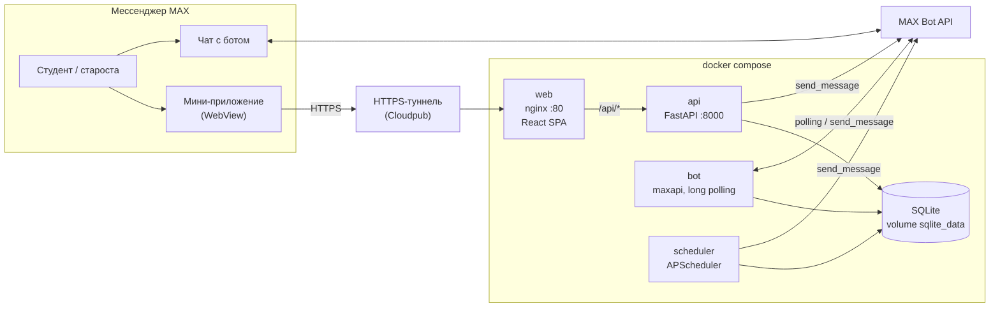

# Архитектура «Мистера Модератора»

## Состав решения

Решение — чат-бот в MAX с подключённым к нему мини-приложением. Серверная часть — один Python-проект, который запускается тремя процессами из одного Docker-образа.



| Компонент | Технологии | Роль | Порт |
|---|---|---|---|
| **web** | React 19, TypeScript, Vite 8, nginx 1.27 | Мини-приложение: дашборд, напоминания, долги, задания, экзамены, материалы, почта, роли. nginx раздаёт статику и проксирует `/api/*` на `api` | 80 в контейнере → `WEB_PORT` (8080) на хосте |
| **api** | Python 3.12, FastAPI, SQLAlchemy 2 (async), Alembic, Pydantic 2 | REST API мини-приложения, проверка initData MAX, права по ролям, ручная рассылка напоминаний. При старте применяет миграции и (при `USE_TEST_DATA=true`) очищает БД и наполняет её тестовыми данными | 8000 → `API_PORT` (8000) |
| **bot** | maxapi 1.2 | Команды в чате: создание группы, вступление по коду и по ссылке-приглашению, привязка группового чата, ссылка на мини-приложение | — (только исходящие запросы к MAX) |
| **scheduler** | APScheduler 3.11 | Автоматические уведомления: вехи напоминаний (7д / 3д / 1д / 8ч / 2ч), просроченные долги, утренняя сводка старосте | — |
| **БД** | SQLite (aiosqlite) в Docker volume; поддерживается PostgreSQL (asyncpg) | Общее хранилище всех трёх процессов | — |

## Почему так

- **Чат-бот + мини-приложение.** Как советует кейс: в чате — то, что делается одним действием (вступить в группу, получить уведомление, открыть приложение); в мини-приложении — списки, формы и связанные сущности (долги группы, расписание экзаменов, роли).
- **Один образ, три процесса.** Бот, API и планировщик разделяют модели и сервисы, но падение одного процесса не останавливает остальные. Образ собирается за секунды.
- **nginx перед API.** Мини-приложение и API живут на одном домене — хватает одного HTTPS-туннеля, CORS не нужен.
- **SQLite по умолчанию.** Для MVP и проверки — ноль внешних зависимостей. Переход на PostgreSQL — смена `DATABASE_URL`: драйвер `asyncpg` уже в зависимостях, миграции Alembic общие.
- **Тестовый режим — один флаг.** `USE_TEST_DATA=true` очищает БД и загружает `seed/test_data.json` (группа `iu7-42b` «ИУ7-42Б» с 12 студентами, напоминаниями, долгами и т.д.). Одна БД, один Alembic — никакого раздвоения схемы.

## Структура кода

```
backend/
  app/
    main.py               # FastAPI: CORS, роутеры, OpenAPI, отправитель уведомлений
    export_openapi.py     # выгрузка схемы в docs/openapi.yaml
    core/
      config.py           # настройки из переменных окружения (pydantic-settings)
      database.py         # async engine и сессии SQLAlchemy
      security.py         # проверка initData MAX (HMAC-SHA256) и токена бота
      deps.py             # get_current_user, require(permission)
      roles.py            # роли, права, меню
      openapi.py          # описания методов для OpenAPI
    api/v1/               # HTTP-слой: по файлу на раздел
    services/             # бизнес-логика; её вызывают API, бот и планировщик
    models/               # SQLAlchemy-модели
    schemas/              # Pydantic-схемы запросов и ответов (camelCase в JSON)
    bot/                  # хендлеры команд и кнопок бота
    scheduler/            # задачи APScheduler
  seed/
    seed.py               # сидер тестовых данных
    test_data.json        # тестовые данные
  alembic/                # миграции схемы БД
web/
  src/
    api/client.ts         # HTTP-клиент; при VITE_USE_API_MOCK=true — моки из api/mock.ts
    contexts/             # текущий пользователь, роли, тема
    hooks/useMaxBridge.ts # MAX Bridge: initData, кнопка «Назад», размер окна
    pages/                # разделы мини-приложения
  nginx.conf              # статика SPA + прокси /api
```

Слои бэкенда: `api` (HTTP и коды ответов) → `services` (правила предметной области) → `models` (хранение). Бот и планировщик вызывают те же `services`, поэтому правила одинаковы для всех каналов.

## Модель данных

```mermaid
erDiagram
    GROUPS ||--o{ USERS : "участники"
    GROUPS ||--o{ REMINDERS : ""
    GROUPS ||--o{ TASKS : ""
    GROUPS ||--o{ DEBTS : ""
    GROUPS ||--o{ EXAMS : ""
    GROUPS ||--o{ MATERIALS : ""
    GROUPS ||--o{ MAILBOXES : ""
    GROUPS ||--o{ MAIL_ITEMS : ""
    EXAMS ||--o{ EXAM_MATERIALS : ""
    USERS ||--o{ DEBTS : "должник"

    GROUPS { string id PK; string name; string chat_id; string invite_code }
    USERS { int id PK; string max_user_id; string first_name; string role_id; string group_id FK }
    REMINDERS { int id PK; string title; datetime deadline; string type; json completed_by }
    TASKS { int id PK; string title; datetime deadline; string type; string status }
    DEBTS { int id PK; int student_id FK; string subject; datetime deadline; string status }
    EXAMS { int id PK; string subject; datetime date; string room; string teacher }
    NOTIFICATIONS_LOG { int id PK; string entity_type; int entity_id; int user_id; string kind }
```

`notifications_log` защищает от повторных уведомлений: каждая веха напоминания (7д / 3д / 1д / 8ч / 2ч) уходит каждому участнику один раз, напоминание о просроченном долге — не чаще раза в сутки.

Все даты хранятся в UTC без часового пояса; расписание планировщика — по московскому времени.

## Авторизация и права

1. MAX открывает мини-приложение и передаёт ему `WebApp.initData` — подписанную строку с данными пользователя.
2. Фронтенд отправляет её в каждом запросе в заголовке `X-Max-Init-Data`.
3. `core/security.py` проверяет подпись HMAC-SHA256 ключом, выведенным из токена бота, и срок годности (1 час). По `user.id` из initData находится или создаётся пользователь.
4. `require("право")` проверяет, есть ли право у роли пользователя (`core/roles.py`).

| Роль | Уровень | Ключевые права |
|---|---|---|
| Староста `starosta` | 4 | Всё, включая управление составом группы и передачу роли старосты |
| Замстаросты `zam` | 3 | Всё, кроме управления составом |
| Профорг / групорг `proforg` | 2 | Материалы, пересылка писем, личные задачи и долги |
| Студент `student` | 1 | Просмотр, личные напоминалки, задачи и долги, загрузка материалов |

Режим `STRICT_AUTH=false` (по умолчанию, для демо и проверки) пропускает проверку и выполняет все запросы от тестового старосты. При `USE_TEST_DATA=true` — это **Иван Петров** в группе `iu7-42b`; при `USE_TEST_DATA=false` — «Тест Тестов» в группе `TEST-GROUP-01`. Так мини-приложение и API можно проверить в обычном браузере без MAX.

## Уведомления

| Когда | Кто получает | Источник |
|---|---|---|
| Кнопка «Напомнить всем» в мини-приложении | Все участники группы, личным сообщением от бота | `api` → `reminder_service.remind_all` / `task_service.remind_all` |
| Каждые 15 минут, на вехах 7д / 3д / 1д / 8ч / 2ч до дедлайна | Участники группы (групповые напоминалки и задания), должник (долги) | `scheduler` → `check_upcoming_deadlines` |
| Ежедневно в 09:00 МСК | Должник с просроченным долгом, не чаще раза в сутки | `scheduler` → `check_overdue_debts` |
| Ежедневно в 08:00 МСК | Староста: сводка по долгам и дедлайнам на сегодня | `scheduler` → `send_daily_summary` |

## Внешние интеграции

| Сервис | Назначение | Статус в MVP |
|---|---|---|
| MAX Bot API | Приём команд, отправка сообщений, проверка токена | Работает, нужен `MAX_BOT_TOKEN` |
| MAX Bridge (`max-web-app.js`) | initData, кнопка «Назад», размер окна | Работает внутри MAX; вне MAX — демо-режим |
| Почтовые ящики (IMAP) | Сбор писем деканата и кафедр | **Не реализовано.** Ящики сохраняются, но синхронизации и пересылки нет: `/mail/refresh`, `/mail/configure`, `/mail/{id}/forward` — заглушки |
| HTTPS-туннель (Cloudpub) | Публичный HTTPS-адрес для мини-приложения | Внешний сервис, запускается вне Docker |